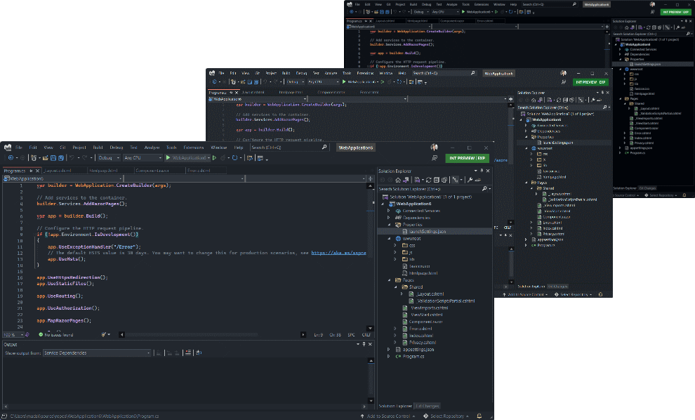
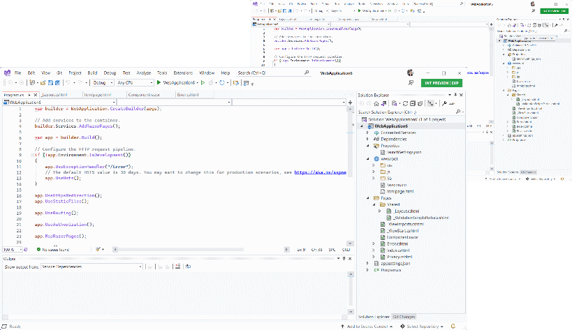
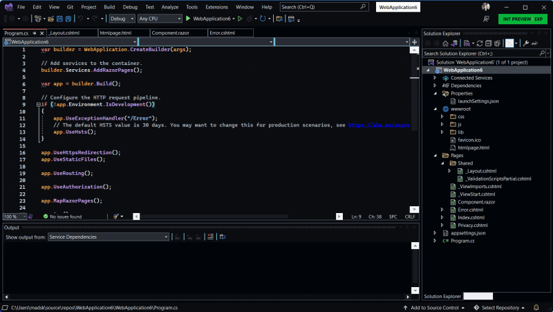

# GitHub themes for Visual Studio

Download the extension at the
[VS Gallery](https://marketplace.visualstudio.com/items?itemName=MadsKristensen.AddNewFile)
or get the
[nightly build](http://vsixgallery.com/extension/2E78AA18-E864-4FBB-B8C8-6186FC865DB3/)

-------------------------------------------------

Port of the popular dark and light GitHub themes for Visual Studio Code. 

## Dark themes

## Light themes

## High contrast theme

## License
[Apache 2.0](LICENSE)
